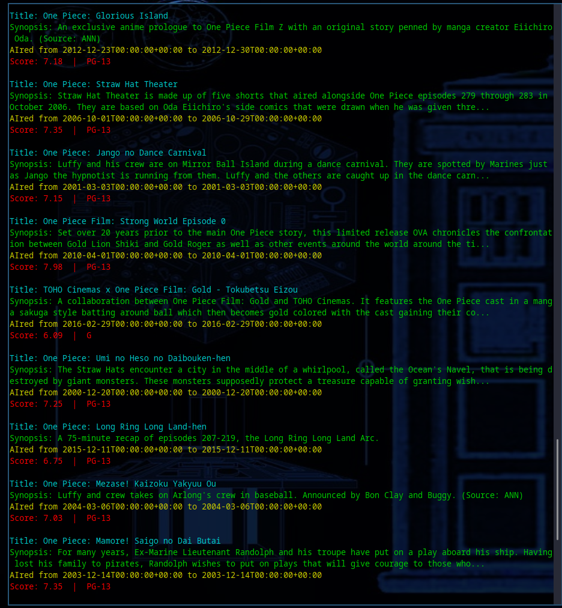

# Anime In The Terminal 

A tiny [maybe] useful script that grabs some basic info on your favorite animes

### **What does the output look like ?**

### how to install 

1. CLone the repo 
2. `cd anime` to get into it
3. Run `bundler install` to install dependencies 
4. Have fuuuuuun

### How to contribute

1. Fork this repo
2. Clone **YOUR FORK** to your local machine
3. `git checkout -b [branch_name]` to create a new branch for local developement 
4. WHen your done with your changes just commit and push to the branch 
5. Make a pull request

***UNDER MIT LICENSE SO DO WUTEVA YOU WANT WITH IT IT'S ALL YOURS***